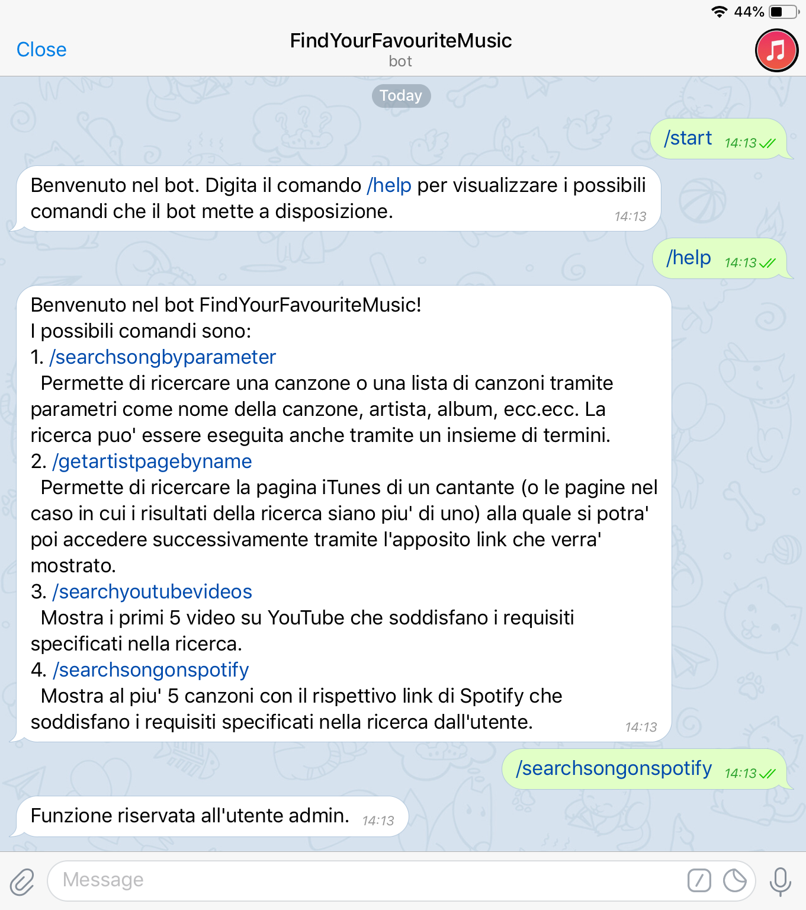

# telegram-server

Repository contenente i file di gestione del WebService, installato sulla piattaforma __Heroku__ che offre continuous delivery, che gestirà le richieste provenienti dal bot di Telegram _@FindYourFavouriteMusicBot_. Il WebService elaborerà le richieste arrivate tramite i comandi del bot, ed inolterà le opportune richieste HTTP al WebService __PiattaformaContenutiMusicali__, che metterà a disposizione le sue API.

Si tratta quindi di un'applicazione lato _client_ per consentire l'utilizzo delle API sviluppate per il progetto del corso [Piattaforme Digitali per la Gestione del Territorio](https://www.uniurb.it/insegnamenti-e-programmi/255577), per il corrente a.a. 2018-2019.

## Implementazione
Il WebService che gestisce le richieste provenienti dal bot è stato implementato con il linguaggio _NodeJS_.
All'interno della repository si trova il file __telegram-server.js__, nel quale è implementato l'_endpoint_ a cui i messaggi inviati al bot di telegram vengono inoltrati.

### telegram-server.js
```bash
app.post('/telegram', (req, res) => {
  ...
  ...
  ...
});
```
L'endpoint _/telegram_ sarà il punto di riferimento a cui i messaggi che l'utente invia al bot verranno inoltrati. I messaggi (che si dividono in _comandi_ e _termini di ricerca_), verranno prima elaborati, e verranno quindi poi eseguite le richieste alla WebApp [PiattaformaContenutiMusicali](https://github.com/m-dilorenzi/piattaformaContenutiMusicali.git).<br>
Per inoltrare tutti i messaggi ricevuti dal bot al nostro WebService e nel relativo corretto path di riferimento, è stato necessario impostare un _webhook_, ovvero una tecnica che permette di reindirizzare tutti i messaggi e i dati ricevuti dal bot al nostro servizio (telegram_server). Per impostare il webhook è stato necessarrio digitare sulla barra di ricerca di un browser internet e digitare
```bash
https://api.telegram.org/bot<bot_token>/setWebhook?url=<url>/telegram
```
dove _bot_token_ indica il token univoco identificativo del bot @FindYourFavouriteMusicBot_ (questo token viene restituito al momento della creazione del bot quando si interagisce con il __@BotFather__) ed il parametro _url_ indica l'indirizzo del nostro WebSerive attivo su Heroku, che nel nostro caso sarà quindi https://telegram-server-pdgt.herokuapp.com.


## Fuzionamento del bot @FindYourFavouriteMusicBot_
Il bot, che funge quindi da client con il quale si potranno sfruttare le API messe a disposizione dalla PiattaformaContenutiMusicali, offre all'utente 5 comandi.

### /start


Il comando _/start_ è il primo comando che si utilizza quando si inizia una nuova chat con il bot. Il suo funzionamento è molto basilare, ed invita l'utente ad utilizzare il comando _/help_ per avere una descrizione maggiormente dettagliata delle funzionalità usufruibili.

### /help


Il comando _help_ restituisce all'utente la lista dei comandi che andranno ad utilizzare le API messe a disposizione dalla __PiattaformaContenutiMusicali__, con relativa descrizione di ciò che l'utente otterrà come risultato una volta specificata la funzionalità della quale vorrà usufruire.

### /searchsongbyparameter


Il comando __searchsongbyparameter__ permette all'utente di ricercare all'interno dell'iTunes Store uno o più brani specificandone il titolo, l'artista o l'album. Nella ricerca si possono specificare contemporaneamente tutti questi attributi o anche solamente uno di questi, naturalmente più sarà precisa la ricerca, più sarà precisa la risposta.
Dopo aver digitato il comando offerto dal bot, viene chiesto all'utente di digitare i termini di ricerca. Il WebService, una volta ricevuti ed opportunamente formattati, utilizzerà tali termini per creare ed inoltrare una richiesta HTTP che avrà come destinatario l'altro WebService (sempre attivo su Heroku) __PiattaformaContenutiMusicali__, il quale elaborerà la richiesta e genererà una risposta in formato JSON, che verrà elaborata ed opportunamente stampata tramite messaggio nella chat del bot.

### /getartistpagebyname


Il comando __getartistpagebyname__ permette all'utente di ricercare all'interno dell'iTunes Store la pagina di un artista. La ricerca avviene tramite la specificazione del nome dell'artista.
Dopo aver digitato il comando offerto dal bot, viene chiesto all'utente di digitare il nome dell'autore che si desidera cercare all'interno dell'iTunes Store. Il WebService, una volta ricevuto ed opportunamente formattato, utilizzerà tale nome per creare ed inoltrare una richiesta HTTP che avrà come destinatario l'altro WebService (sempre attivo su Heroku) __PiattaformaContenutiMusicali__, il quale elaborerà la richiesta e genererà una risposta in formato JSON, che verrà elaborata ed opportunamente stampata tramite messaggio nella chat del bot.

### /searchyoutubevideos


Il comando __searchyoutubevideos__ permette all'utente di ricercare all'interno di YouTube uno o più video di un brano musicale (questa funzionalità permette anche la normale ricerca di qualsiasi tipo di video).
Dopo aver digitato il comando offerto dal bot, viene chiesto all'utente di digitare i termini di ricerca con i quali avverrà la ricerca su YouTube. Il WebService, una volta ricevuti ed opportunamente formattati, utilizzerà tali termini per creare ed inoltrare una richiesta HTTP che avrà come destinatario l'altro WebService (sempre attivo su Heroku) __PiattaformaContenutiMusicali__, il quale elaborerà la richiesta e genererà una risposta in formato JSON, che verrà elaborata ed opportunamente stampata tramite messaggio nella chat del bot.

### /searchsongonspotify


Il comando __searchsongonspotify__ permette all'utente di ricercare all'interno di Spotify uno o più brani musicali specificandone attributi quali nome del brano, autore o titolo dell'album.
Dopo aver digitato il comando offerto dal bot, viene chiesto all'utente di digitare i termini di ricerca con i quali avverrà la ricerca su Spotify. Il WebService, una volta ricevuti ed opportunamente formattati, utilizzerà tali termini per creare ed inoltrare una richiesta HTTP che avrà come destinatario l'altro WebService (sempre attivo su Heroku) __PiattaformaContenutiMusicali__, il quale elaborerà la richiesta e genererà una risposta in formato JSON, che verrà elaborata ed opportunamente stampata tramite messaggio nella chat del bot.

Questa funzione, a differenza delle altre, è riservata all'utende admin, ovvero al creatore del progetto e delle API. Nel caso in cui un altro utente voglia usufruire di questa funzione, verrà segnalata l'impossibilità di eseguire tale operazione tramite un opportuno messaggio, come mostrato di seguito.



Tale funzione inoltre richiede, per l'accesso ai dati di Spotify, un _ACCESS_TOKEN_ dalla validità di un'ora. Le gestione di tale token, con relativo _refresh_ nel caso in sui esso sia scaduto, viene gestita da questo WebService, così da velocizzare i tempi di risposta da parte delle API di _PiattaformaContenutiMusicali_.<br>
La gestione di tale token avviene in due passaggi:
  1. Controllo della validità del token di accesso
  2. Richiesta di un nuovo token tramite il _refresh_token_ nel caso in cui il token di accesso sia stato etichettato come scaduto.

Una volta ottenuto un nuovo token tramite una richiesta HTTP in POST come la seguente
```bash
  var bodyRequest = querystring.stringify({
    grant_type: 'refresh_token',
    refresh_token: process.env.SPOTIFYKEYREFRESH
  });

  const clientreq = https.request({
    method: 'POST',
    host: 'accounts.spotify.com',
    path: '/api/token',
    headers: {
      'Content-Type':'application/x-www-form-urlencoded',
	    'Authorization':'Basic '+process.env.SPOTIFYBASE64ID
    },	  
  });

```
il nuovo token verrà poi passato come parametro nella richiesta HTTP al WebService che offre alla disponibilità dell'utente le API.

_process.env.SPOTIFYBASE64ID_ e _process.env.SPOTIFYKEYREFRESH_ sono due codici alfanumerici che indicano un preciso progetto di un preciso utente che è stato creato nella dashboard del profilo Spotify. La funzione è quindi riservata all'utente admin poichè le ricerche che verranno effettuate compariranno sotto il nome dell'utente che ha creato il progetto a cui sono state assegnate tali credenziali, ovvero l'utente admin che ha sviluppato le API.
